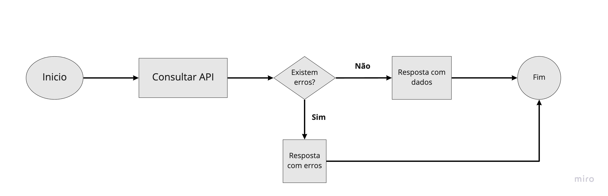

# Orchestryzi

### O que é?
Conforme a quantidade de microsserviços cresce, também cresce a sua complexidade. Por isso o time da Devyzi desenvolveu um orquestrador baseado em fluxos de processos para tornar mais difícil a visibilidade da distribuição dos fluxos sem a utilização de um orquestrador central.

### Por que microsserviços?
Muito se fala em microsserviços atualmente e, neste ambiente complexo e com muita atividades paralelas e automações de processos de negócios, é necessário um serviço de orquestração. Assim, o Orchestryzi habilita a orquestração entre os serviços e também fornece controle e visibilidade para as interações. Essa habilidade da ao time de engenharia a possibilidade de alavancar os serviços existentes, construir novos fluxos e atualizar os existentes, aumentando assim a velocidade de utilização do fluxo, o que forneceu uma rota efetivamente mais fácil para a adoção da solução.

### O que são workspaces?
Um workspaces é um grupo de configurações, fluxos e funções que compõe um projeto. Um woskpace padrão tem a seguinte estrutura:


```
workspaces
│
└───example1
│   │
│   └───config
│   |   │   settings.json
|   |
|   └───flows
|   |   | example_flow.json
|   |
|   └───functions
|   |   | example.py
|   |
|   | routes.json
│   
└───example2
|    │   ...
|
...
```

[Ver alguns exemplos](examples/workspaces)

## Como criar um fluxo de trabalho (flow)?

Vamos ver um exemplo muito simples de um fluxo de trabalho



### Definição das tarefas
O comportamento de cada fluxo é controlado por seu template. Uma definição de um fluxo fornece parâmetros de controle para cada tarefa. Uma tarefa pode ser do tipo executadora, implementada pela aplicação, ou de sistema, que é executada pelo servidor de orquestração. 

### Ações
O Ochestryzi fornece ações de sistema fora da caixa, como switchs, requests, declarações, jumps, etc. 

#### Uma ação tem como template o seguinte fragmento em JSON

```json
{
    "id": "1",
    "action": "start",
    "data": {},
    "next_action": "2"
}
```

Essa estrutura é utilizada para definir o que vai ser executado e qual é a próxima ação a ser executada. No exemplo acima a ação `start` é onde o fluxo é iniciado, ela tem um `id` que é necessário para orientar a pipeline a ordem de execução das ações, em seguida o campo `action` determina qual ação vai ser executada naquele momento e o campo `data` fornece o modelo de dados utilizado pela ação, e por ultimo e não menos importante, o campo `next_action` determina qual é a próxima ação a ser executada com base em seu id.


#### Fragmento em JSON de uma definição de tarefa

```json
{
    "id": "f9033cf9-2336-474f-b785-0c334177dfb3",
    "name": "Github",
    "pipeline": [
        {
            "id": "1",
            "action": "start",
            "data": {},
            "next_action": "2"
        },
        {
            "id": "2",
            "action": "flow_var",
            "data": {
                "url": "${env.baseUrl}/users/${request.qs.user}/repos?sort=updated&direction=asc"
            },
            "next_action": "3"
        },
        {
            "id": "3",
            "action": "request",
            "data": {
                "url": "${flow.url}",
                "method": "get",
                "headers": {},
                "data": {},
                "next_action_success": "4",
                "next_action_fail": "5"
            },
            "next_action": "${pipeline.next_action}"
        },
        {
            "id": "4",
            "action": "response",
            "data": {
                "status": 200,
                "headers": {},
                "data": {
                    "data": "${response.data}"
                }
            },
            "next_action": null
        },
        {
            "id": "5",
            "action": "response",
            "data": {
                "status": 400,
                "headers": {},
                "data": {
                    "msg": "Something went wrong",
                    "data": "${response.data}"
                }
            },
            "next_action": null
        }
    ]
}
```

#### Veja a lista de ações disponíveis atualmente e como utiliza-las:

* [start](actions/start.md)
* [flow_var](actions/flow_var.md)
* [workspace_var](actions/workspace_var.md)
* [request](actions/request.md)
* [response](actions/response.md)
* [switch](actions/switch.md)
* [validation](actions/validation.md)

## Conceitos chaves

* [Template literals](concepts/template_literals.md)
* [Funções](concepts/functions.md)